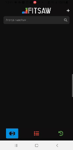
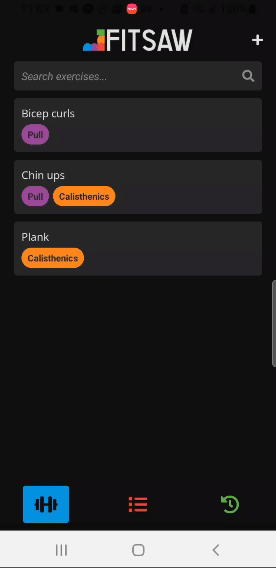
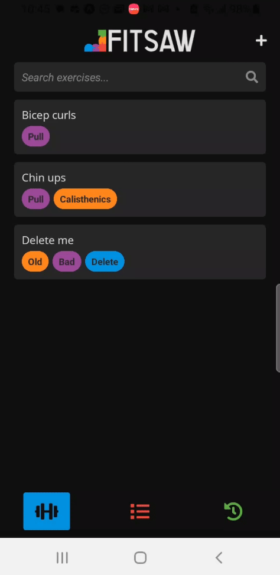
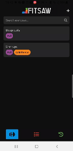
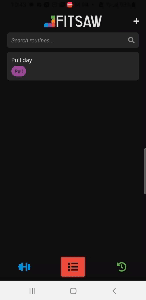

# Fitsaw
An application for creating fully customizable routines in a modular way. Start by creating exercises and then assemble them into routines in any way you see fit. No more forgetting what set you're on or what exercises you do on leg day; it's all here, all in one place.

## Exercises
### Create

- Add a description to help you remember key tips
- Include tags for easy searchability
- Select whether the exercise is for time or for reps, weighted or unweighted
### Update

- Modify any of the exercise's field and the changes will apply to all routines that exercise is in
### Delete

- Delete exercises by swiping left
- Exercises will be removed from the routines they are found in

## Routines
### Create

- Create a routine comprised of exercises from your exercise library
### Start

- Start and track your routine. When your done, your progress will be saved in the history tab
### Update

- Reorder exercises by dragging up and down the list

## What's next?
In future versions I'll be looking to add online routine sharing. That way, you won't need to scour through the internet transcribing various routines; they'll all be available with the single tap. I'll also be looking to add a routine queue so exercises can be reordered mid routine along with editable fields mid routine so weights and reps can be changed on the fly. In short: there's much more to come. Stay tuned!